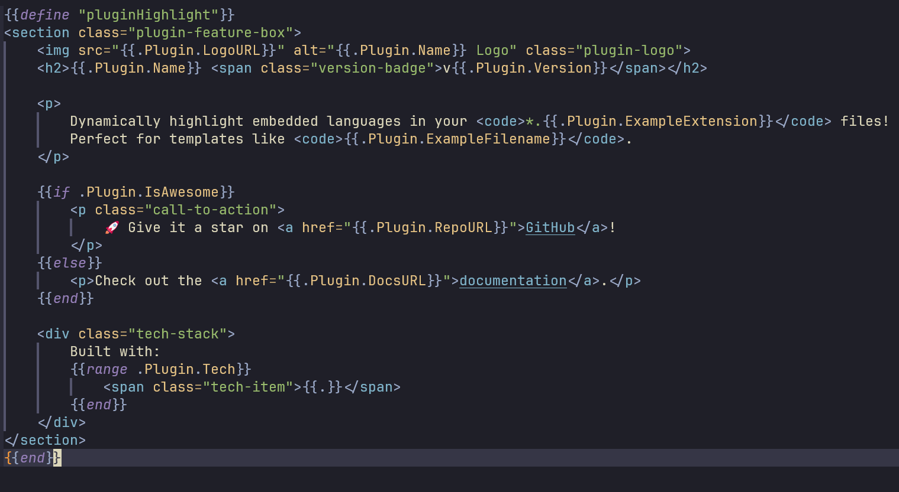

# composite-highlighting.nvim

[](http://www.lua.org)
[](https://neovim.io/)
[](https://opensource.org/licenses/MIT)

`composite-highlighting.nvim` enhances Neovim's Treesitter capabilities by enabling dynamic syntax highlighting for two different languages simultaneously within the same file.

For example, a file named `my_page.html.tmpl` can be highlighted as a Go Template (`gotmpl`) on the outside, while the content within the template is dynamically highlighted as HTML. Similarly, `my_script.js.tmpl` would inject JavaScript.

## ✨ Features

- **Dynamic Language Injection:** Injects syntax highlighting for an inner language based on the template filename (e.g., `*.<inner_ext>.tmpl`).
- **Configurable Template Parsers:** Define which outer template languages, file extensions, and specific Treesitter nodes should be used for dynamic injection.
- **Treesitter Powered:** Leverages Neovim's Treesitter for accurate and efficient parsing.
- **Intelligent Defaults & Fallbacks:** Provides sensible defaults for common template engines and a fallback mechanism for unsupported ones.

## 📸 Screenshot

The following screenshot shows an `index.html.tmpl` file. The Go template syntax is highlighted by the `gotmpl` parser, while the surrounding HTML structure and content are highlighted by the `html` parser.


_(Assumes your image is at `public/images/demo.png` in your repo. Adjust path if needed.)_

## 📋 Requirements

- Neovim >= 0.8 (for Treesitter Lua APIs)
- `nvim-treesitter` plugin (as this plugin configures Treesitter injections)
- Treesitter parsers installed for:
  - The **outer** template languages you configure (e.g., `gotmpl`, `eruby`, `jinja`).
  - The **inner** languages you intend to inject (e.g., `html`, `javascript`, `css`).

## 📦 Installation

Install using your favorite plugin manager:

### [lazy.nvim](https://github.com/folke/lazy.nvim)

```lua
{
  "eggplannt/composite-highlighting.nvim",
  dependencies = { "nvim-treesitter/nvim-treesitter" },
  config = function()
    require("composite-highlighting").setup({
      -- Your configuration here
      languages = {
        { parser = "gotmpl", extension = "tmpl" },
        -- Add other template languages if needed
        -- { parser = "jinja", extension = "jinja2", injection_node = "template_data" },
      },
    })
  end,
}
```

### [packer.nvim](https://github.com/wbthomason/packer.nvim)

```lua
use {
  "eggplannt/composite-highlighting.nvim",
  requires = { "nvim-treesitter/nvim-treesitter" },
  config = function()
    require("composite-highlighting").setup({
      -- Your configuration here
      languages = {
        { parser = "gotmpl", extension = "tmpl" },
        -- Add other template languages if needed
      },
    })
  end,
}
```

**Important:** Ensure that the Treesitter parsers for both your template language (e.g., `gotmpl`) and the languages you intend to inject (e.g., `html`, `javascript`, `css`) are installed via `nvim-treesitter`. You can install them with `:TSInstall gotmpl html javascript` etc.

## ⚙️ Configuration

The plugin is configured by calling the `setup` function. The main option is `languages`.

```lua
require("composite-highlighting").setup({
  languages = {
    -- Example 1: Go Templates (uses internal default injection node, likely 'text')
    {
      parser = "gotmpl",
      extension = "tmpl",
    },
    -- Example 2: Jinja2, explicitly specifying the injection node
    {
      parser = "jinja", -- Ensure 'jinja' parser is installed (often covers .jinja2, .j2)
      extension = "jinja2",
      injection_node = "template_data", -- Or 'text', 'content' depending on your Jinja parser
    },
    -- Example 3: ERuby
    {
      parser = "eruby",
      extension = "erb",
      -- injection_node = "text", -- Often 'text' for ERB, can be explicit
    },
    -- Example 4: If your template parser name is the same as its common extension
    -- and you want to rely on internal defaults or the 'text' fallback for the injection node.
    {
      parser = "mycustomtmpl", -- Assumes '.mycustomtmpl' files
      -- 'extension' will default to 'mycustomtmpl' if omitted
      -- 'injection_node' will use internal map or fallback to 'text'
    },
  },
})
```

### `languages` Option

The `languages` option is an array of tables, where each table configures a template type:

- `parser` (string, **required**): The name of the installed Treesitter parser for the outer template language (e.g., `"gotmpl"`, `"jinja"`, `"eruby"`). The plugin will warn and skip if this parser is not installed.
- `extension` (string, optional): The file extension that identifies these template files (e.g., `"tmpl"`, `"jinja2"`, `"erb"`).
  - If omitted, `extension` defaults to the value of `parser`.
  - The plugin uses this to associate files with the `parser`'s primary filetype.
- `injection_node` (string, optional): The specific Treesitter node within the `parser`'s grammar that should contain the injected language.
  - If omitted, the plugin will:
    1.  Check an internal map of common `parser`-to-node mappings (e.g., `gotmpl` -> `text`).
    2.  If not found in the map, it will fallback to using `"text"` as the node name.
  - This option is crucial for less common template engines or when the default/fallback node is not suitable. See "Finding the Correct `injection_node`" below.

## 🚀 How it Works (for the nerds)

For each configured language in the `languages` option:

1.  The plugin registers the specified `extension` to be recognized as the filetype associated with the `parser` (e.g., `.tmpl` files become `gotmpl`).
2.  It determines the Treesitter node to target for injection. The precedence is:
    1.  User-provided `injection_node` in the language configuration.
    2.  Node from an internal `parser_to_tag` map (e.g., `gotmpl` -> `text`).
    3.  A general fallback of `"text"`.
3.  It then sets up a Treesitter injection query for this filetype, targeting the determined node (e.g., `(text @injection.content)` or `(template_data @injection.content)`).
4.  When such a node is encountered in a file like `filename.<inner_ext>.<outer_ext>` (e.g., `my_page.html.tmpl`), a custom directive `inject-<parser>!` is triggered.
5.  This directive attempts to determine the `<inner_ext>`:
    - It strips the `.<outer_ext>` (e.g., `.tmpl`) from the buffer's filename.
    - It then tries to get the filetype of the remaining part (e.g., `my_page.html`) using:
      1.  `vim.filetype.match({ filename = "my_page.html" })`
      2.  If that fails, it extracts the extension (e.g., `html`) and tries `vim.filetype.match({ filename = "file.html" })`.
      3.  As a final fallback, it consults an internal map of common extensions to filetypes (e.g., `ts` -> `typescript`, `js` -> `javascript`).
6.  The determined inner filetype is then used for syntax highlighting within the targeted injection node.

## 💡 Notes & Troubleshooting

- **Parser Installation:** The most common issue will be missing Treesitter parsers. Ensure both the outer template parser (e.g., `gotmpl`) and any inner language parsers (e.g., `html`, `javascript`, `css`, `python`) you expect to be injected are installed via `nvim-treesitter` (`:TSInstall <parser_name>`).
- **Filename Convention:** The plugin relies on the `filename.<inner_ext>.<outer_ext>` convention for dynamic injection.
- **Finding the Correct `injection_node`:**
  - If the default injection behavior isn't working for your specific template language (even if the parser is installed), you might need to specify the `injection_node`.
  - To find the correct node:
    1. Open a template file of that type.
    2. Run `:InspectTree` (provided by `nvim-treesitter`). This opens a split window showing the syntax tree.
    3. Navigate your cursor in the template file to the general content area where you expect the inner language to be.
    4. Observe the highlighted node in the `:InspectTree` window. This node name (e.g., `template_data`, `content`, `text_blob`) is what you should use for the `injection_node` option.
  - If you find a good `injection_node` for a common parser not yet in our internal defaults, please consider contributing it!

## 🤝 Contributing

Contributions, issues, and feature requests are welcome! Please feel free to open an issue or submit a pull request on [GitHub](https://github.com/eggplannt/composite-highlighting.nvim).

## 📜 License

This project is licensed under the MIT License. See the [LICENSE](LICENSE) file for details.
